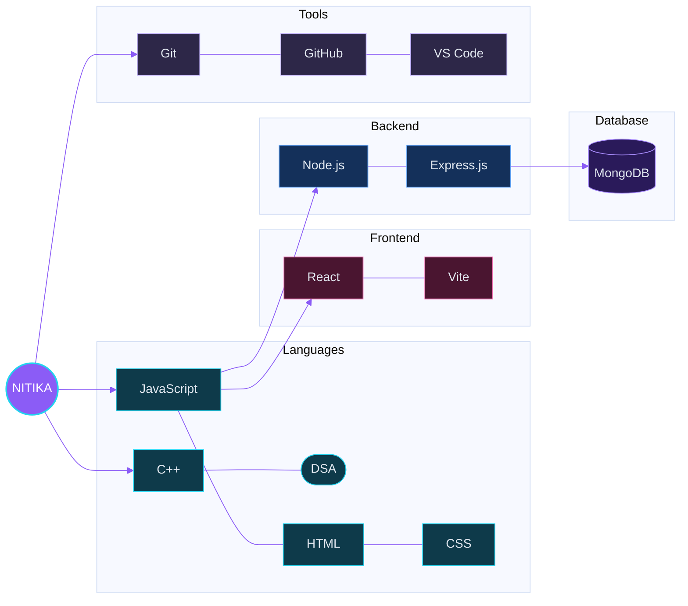
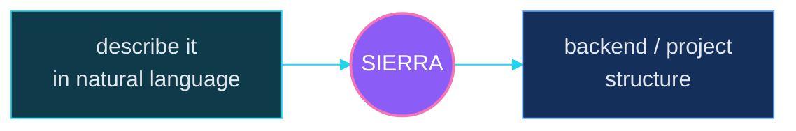
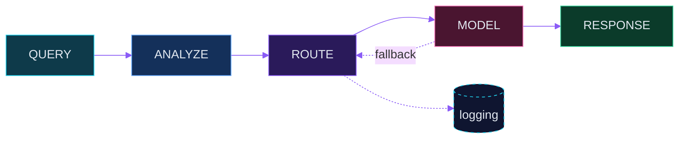
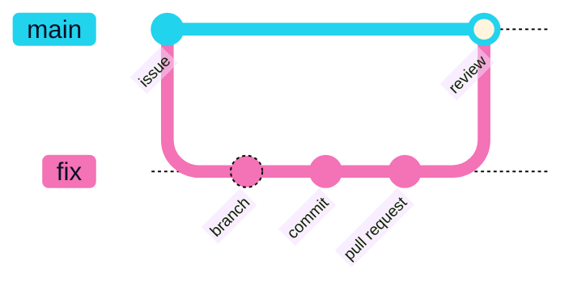

<div align="center">


**Full-Stack Developer • Open Source Contributor • Competitive Programmer**

<a href="#about"></a>
<a href="#skills"></a>
<a href="#projects"></a>
<a href="#open-source"></a>
<a href="#stats"></a>
<a href="#connect"></a>

</div>

<br>

<h2 id="about" align="center">⟨ SYSTEM_STATUS ⟩</h2>

<table align="center">
  <tr>
    <td valign="top" width="33%">
      <b>CURRENTLY BUILDING</b><br><br>
      Full-stack projects<br>+ real-world software
    </td>
    <td valign="top" width="33%">
      <b>CURRENTLY LEARNING</b><br><br>
      › Backend development<br>
      › Advanced DSA<br>
      › Open Source<br>
      › Competitive Programming
    </td>
    <td valign="top" width="33%">
      <b>CURRENTLY EXPLORING</b><br><br>
      › AI × Software<br>
      › Developer tools<br>
      › Startups
    </td>
  </tr>
</table>

```text
MISSION   become a stronger software engineer by building, contributing and experimenting.
LOCATION  Lucknow, Uttar Pradesh   ·   YEAR 2 / SEM 3   ·   TARGET  software-development internships
```

<br>

<h2 id="skills" align="center">⟨ SKILL_CONSTELLATION ⟩</h2>



<br>

<h2 id="projects" align="center">⟨ PROJECTS // MISSION_LOG ⟩</h2>

### 01 · SIERRA &nbsp; <sub>flagship</sub>

An AI-powered backend/project generation concept: describe what you want in natural language, and the system helps generate the backend/project structure.

     



### 02 · SIGNAL-AI-ROUTER

An intelligent AI model-routing project: different types and complexities of queries get routed to an appropriate model, with fallback and logging.



### 03 · EMERALD RUN — MOODRUNNER

A React + Vite + Phaser 3 forest platformer with webcam-based mood detection that can influence gameplay.


        

<div align="center">

<a href="https://github.com/nitikagotra75-crypto?tab=repositories"></a>

</div>

<br>

<h2 id="open-source" align="center">⟨ OPEN_SOURCE_MODE = ON ⟩</h2>

Open source isn't a side note. It's an active part of my developer journey: **GitHub issues · pull requests · repository contributions**, including work around Zulip Desktop.



<sub>↑ the contribution workflow: issue → branch → commit → pull request → review.</sub>

<div align="center">

<a href="https://github.com/zulip/zulip-desktop/pulls?q=is%3Apr+author%3Anitikagotra75-crypto"></a>
<a href="https://github.com/search?q=author%3Anitikagotra75-crypto+is%3Apr&type=pullrequests"></a>

</div>

<br>

<h2 id="stats" align="center">⟨ PLAYER_STATS ⟩</h2>

```text
PLAYER 01 ── NITIKA GOTRA
CLASS  full-stack builder
GUILD  University of Lucknow · B.Tech CSE · Year 2 · Sem 3
MAIN QUEST   ship real-world products
SIDE QUESTS  open source · backend · competitive programming
```

<div align="center">


<br><br>


</div>

<br>

<h2 id="beyond" align="center">⟨ BEYOND_THE_CODE ⟩</h2>

<div align="center"><i>Things that somehow keep sneaking into my code.</i></div>

<br>

| | | |
|:--|:--|:--|
| 🎮 **games** <br><sub>Emerald Run — MoodRunner is a platformer</sub> | 🌸 **anime** <br><sub>always running in the background</sub> | 🎨 **creative UI** <br><sub>this README, mostly</sub> |
| 🤖 **AI experiments** <br><sub>Sierra · Signal-AI-Router</sub> | 💡 **unusual ideas** <br><sub>a game that reads your mood</sub> | 🚀 **startups** <br><sub>real products over tutorials</sub> |

<br>

<h2 id="connect" align="center">⟨ OPEN_CHANNELS ⟩</h2>

<div align="center">

<a href="https://github.com/nitikagotra75-crypto"></a>
<a href="https://github.com/nitikagotra75-crypto?tab=repositories"></a>

<br><br>


</div>
